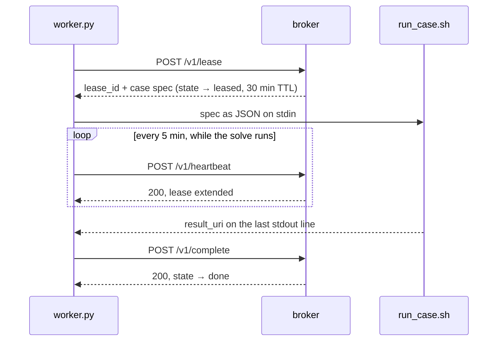

# The protocol

How a worker and the broker talk, and what each call promises.
See [DOMAIN.md](../DOMAIN.md) for what the nouns mean.

## How the client and server interact

The broker is an HTTP service in front of a database. It hands out work and
records results, and it **never initiates anything** — it does not know which
machines exist until one asks for a case, and it cannot reach into a cluster to
start a job. Every machine runs the same client, and each one *pulls*:

```
  PACE Phoenix  ──┐
  PACE ICE      ──┤   POST /v1/lease        ┌──────────┐      ┌──────────┐
  workstation   ──┼──  "give me a case"  ──▶│ casebroker│ ───▶ │ Postgres │
  anyone else   ──┘                         └──────────┘      └──────────┘
                                             stateless         the campaign
```

That is the whole reason for a broker rather than splitting the case list up
front: the machines differ by more than an order of magnitude in throughput and
Phoenix's availability changes hour to hour, so a fast box simply comes back
sooner. Adding a machine needs no server-side change — only a URL and a token.

### One case, end to end

A worker loops: lease → run → report → repeat. The wrinkle is that a case takes
**hours** while a lease lasts **30 minutes**, so the client renews it from a
background thread while the CFD runs.



**The lease is the unit of ownership, not the case.** Every call after the first
is keyed by `lease_id`, never by `case_id` — that is what lets the broker tell
the rightful owner from a worker that woke up late still holding a stale claim.

Step by step:

1. **Lease.** Ask for one case. An empty list back means the queue is drained —
   a normal answer, not an error; after ten idle polls the worker exits so the
   SLURM allocation is freed.
2. **Receive.** The broker atomically claims a row and returns a `lease_id` with
   the full spec. Concurrency is settled here, inside one SQL statement.
3. **Run.** The spec goes to `run_case.sh` as JSON on stdin. The broker knows
   nothing about OpenFOAM; this is the only seam.
4. **Heartbeat.** A background thread renews every 5 min. A **409** means the
   case was taken away — the worker abandons it rather than finishing work it no
   longer owns.
5. **Report.** The runner's last stdout line carries `result_uri`; the worker
   posts it with metrics, wall time and which machine produced it. Among the
   metrics, `height_source` names the building source the mesh was built from
   (`gba-lod1`, or `overture`), read from the geometry report beside the STLs —
   the case inspector draws a finished case from it.
6. **Repeat.**

Defaults are the client's: `lease_seconds=900`, `heartbeat_seconds=300`.

### When a worker dies

Phoenix's free `embers` QOS preempts after an hour, so a worker dying mid-solve
is the *normal* case, not an edge case. All three paths end with the work getting
done; they differ in how much is wasted.

| | What happens | Cost |
| --- | --- | --- |
| **Preempted** (SIGTERM first) | The client catches the signal and calls `POST /v1/release`. State → `pending`, **and the attempt is refunded** — preemption is not the case's fault. | One partial solve. Back in the pool in under a second. |
| **Killed** (no warning) | Heartbeats simply stop and the lease TTL lapses. Nothing detects this, and nothing needs to. | Up to one lease period of idle before someone re-leases it. |
| **Zombie returns** | The old worker finishes and calls `complete` with a superseded `lease_id`. Rejected with **409**; the real owner's result stands. | Nothing — but see below. |

The third is the dangerous one, and why every mutating call re-checks the lease
rather than trusting it — see *Three design decisions worth knowing* below for
what that prevents. The operational rule it leaves you with: **a 409 means
stop.** Wherever it appears, heartbeat or complete, the case belongs to someone
else now, and continuing burns core-hours on a result the broker will refuse.

## The protocol

### Who may call what

Three kinds of principal, and every endpoint below is gated on one of them.

| Principal | How it authenticates | Gets |
| --- | --- | --- |
| A logged-in **admin** | session cookie from `POST /v1/auth/login` | everything |
| A logged-in **operator** | the same | runs the campaign: everything a worker can do, plus adding cases. `403` from `DELETE /v1/cases`, from the identity endpoints, and from `/v1/workers/tokens`. The role most accounts should have |
| A logged-in **viewer** | the same | reads only; `403` from every mutating endpoint |
| A **machine** | `Authorization: Bearer <per-machine token>` | read and write, but never the identity endpoints — a worker credential that could mint more worker credentials would defeat the point of issuing them per machine. It may only lease as **its own** worker id or one under it — `phoenix` covers `phoenix-<job>-<task>`, which is how a cluster gets one revocable credential — and gets `403` otherwise, so the Machines list is a fact rather than a claim |
| A **shared env token** | `Authorization: Bearer <value>` | read and write (`CASEBROKER_WRITE_TOKENS`) or read only (`CASEBROKER_READ_TOKENS`). The older model; still honoured |

With **no env tokens and no accounts**, auth is off entirely and every caller
gets write. `GET /healthz` reports `"auth": "OPEN"` so that is visible rather
than silent. Creating the first account closes it.

### Identity

| Endpoint | Purpose |
| --- | --- |
| `GET /v1/auth/state` | What the login UI needs before anything is typed: `needs_setup`, `setup_token_required`, the `roles` this broker accepts (so a picker cannot drift from the server), and who you already are. **Unauthenticated** — it leaks nothing beyond "has this broker been set up", which is obvious from whether logging in is possible |
| `POST /v1/auth/setup` | Create the FIRST account, which is an admin. **Open only while there are none**, and `409` forever after. Requires `CASEBROKER_SETUP_TOKEN` if set, else one of `CASEBROKER_WRITE_TOKENS` if any are set, else nothing — see [First run](operations.md#first-run-from-nothing-to-a-working-broker). A read token is never enough |
| `POST /v1/auth/login` | Username and password for a session cookie. Throttled: 10 failures per account per source address in 5 minutes, then `429` |
| `POST /v1/auth/logout` | Delete the session server-side |
| `GET /v1/users` | Every account, its role, and when it last logged in. **Admin** |
| `POST /v1/users` | Add an account. Defaults to `viewer` unless `role` says otherwise, so a privilege is asked for rather than inherited by omission. **Admin** |
| `POST /v1/users/{username}/role` | Promote or demote. Refuses to demote the last admin. **Admin** |
| `POST /v1/users/{username}/password` | Change your own (needs `current_password`) or, as an admin, reset someone else's. Revokes every session that account holds |
| `DELETE /v1/users/{username}` | Remove an account and its sessions. Refuses the last admin |
| `GET /v1/workers/tokens` | Every machine credential, with `last_seen_at`. **Admin** |
| `POST /v1/workers/tokens` | Mint one machine's credential and return it **once** — only its hash is stored. **Admin** |
| `DELETE /v1/workers/tokens/{name}` | Revoke one machine, effective on its next request. **Admin** |

### The campaign

| Endpoint | Purpose |
| --- | --- |
| `POST /v1/cases` | Append cases. **Idempotent** — re-posting an existing id is a no-op, which is how the dataset grows |
| `GET /v1/cases` | Paginated, filterable (`state`, `split`, `city_cluster`) list of cases, most recently touched first — what the dashboard's case browser calls |
| `GET /v1/cases/{case_id}` | One case's full record by id |
| `POST /v1/lease` | Claim up to N cases. Empty list = drained, not an error. Workers report their `host`/`cluster` here (optional) so "what machine produced this" stays answerable later |
| `POST /v1/heartbeat` | Extend the lease. **409 means stop working on that case**. Refused once the lease is older than `CASEBROKER_MAX_LEASE_AGE` (7 days), which releases the case: a heartbeat proves the worker is alive, not that it is progressing |
| `POST /v1/complete` | Report a result pointer + metrics. Send `case_id` alongside `lease_id`: it scopes the retry-safety check to this case, so a runner whose `result_uri` is not unique per case cannot have one case's retry confirmed by another's row. Optional, so older workers keep working |
| `POST /v1/fail` | Report a failure; `retryable=false` quarantines immediately |
| `POST /v1/release` | Graceful preemption — requeues and **refunds the attempt** |
| `DELETE /v1/cases` | Purge a superseded campaign, with its events and footprints. **Admin session** (a write bearer token also passes, as it always has; an `operator` session does not). `dry_run` defaults to **true**, so a half-remembered curl reports what it would have deleted instead of deleting it; `expect` is the real interlock — state the row count you believe you are removing, and a mismatch refuses |
| `GET /v1/status` | Counts by state and split, expired leases, 24 h throughput, ETA |
| `GET /healthz` | Liveness, plus the running `version`, auth posture (`token` / `accounts` / `OPEN`), per-scope token counts and redacted DB target. **Unauthenticated** — see Deploying |
| `GET /v1/whoami` | What the presented credential can do (`write` / `read` / `none`) **and which kind it is** — a session, a per-machine token, or a shared env token. **Unauthenticated** — it answers *about* a credential rather than gating on one |
| `GET /v1/share-token` | The read-only token, so the dashboard can mint a shareable link. **Write auth** — not an escalation, since a write token already passes every read gate |
| `POST /v1/pair/start` | A machine asks to join: `{name, token_hash, host?, platform?}` → `{user_code, verification_url, expires_in, interval}`. **Unauthenticated** (it has nothing to authenticate with yet), so throttled per address and the queue is bounded. The node generates its own token and sends only the SHA-256 — the raw credential never reaches the broker |
| `POST /v1/pair/poll` | `{user_code}` with the token as bearer → `pending` / `approved` / `denied` / `expired` / `superseded`. An unknown code and a wrong token get the same 404 |
| `GET /v1/pair/pending`, `POST /v1/pair/{code}/approve`, `…/deny` | The dashboard's side. **Admin session only** — a credential that could approve machines could mint credentials |
| `POST /v1/cases/land-audit` | Find cases already in the campaign whose coordinates are not on land and quarantine them. `dry_run=true` by default — it reports and changes nothing. **Write auth** |
| `POST /v1/fleet` | Report what a scheduler holds (`cluster`, `queued`, `running`). The broker cannot see SLURM; `casebroker fleet` pushes this from a login node |
| `GET /v1/cases/{case_id}/footprints` | Everything a case is meshed from, cached: building footprints with predicted heights (GeoJSON), plus `terrain` (GEDTM30 relief grid) and `canopy` (Meta/WRI tree heights) over the mesh domain. Same sources and bbox the runner meshes, so the picture is the geometry. The buildings come from the source the case's mesh was built from — its reported `height_source`, Overture if it finished before the switch to GBA, GBA otherwise — carried back as `mesh_source`, with `mesh_source_basis` saying how that is known. `source` is what actually answered, with `fallback_from` when the mesh's source could not be drawn; a cached row from a different source is queried again, and concurrent requests for one case share one query |

State machine:

```
pending --lease--> leased --complete--> done
   ^                  |
   |                  +-- fail(retryable) | lease expiry --> pending
   |                  +-- fail(fatal) | attempts > max ----> quarantined
   +-- release (preemption, attempt refunded) ---------------+
```

## Three design decisions worth knowing

**Lease expiry is the only liveness mechanism.** A worker that dies without
warning is not detected, reported, or reaped by anything; its lease simply lapses
and the next `POST /v1/lease` reclaims the case in the same statement that hands
out fresh work. There is no reaper process to run or monitor.

**A superseded lease cannot write.** If a worker is preempted, its case is
re-leased, and the original worker then wakes up and finishes, its `complete`
is rejected with 409. Without that, a zombie could overwrite the real owner's
result — and it would look exactly like a successful run.

**Splits are assigned by city, not by tile.** Tiles from one city share
morphology and often literal buildings at their edges, so a per-tile split leaks
the test set into training. `ids.split_for(city_cluster)` hashes the city, which
also means an existing case can never change split when the dataset grows —
unlike v1's `make_splits.py`, whose seed-42 shuffle over a fixed list reshuffles
everything the moment a case is appended.
