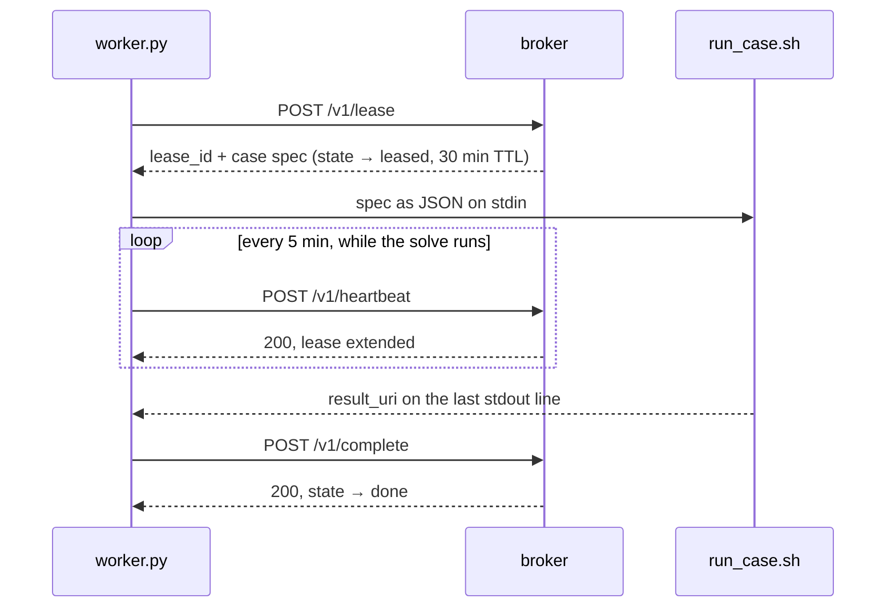

# The protocol

How a worker and the broker talk, and what each call promises.
See [DOMAIN.md](../DOMAIN.md) for what the nouns mean.

## How the client and server interact

The broker is an HTTP service in front of a database. It hands out work and
records results, and it **never initiates anything** — it does not know which
machines exist until one asks for a case, and it cannot reach into a cluster to
start a job. Every machine runs the same client, and each one *pulls*:

```
  PACE Phoenix  ──┐
  PACE ICE      ──┤   POST /v1/lease        ┌──────────┐      ┌──────────┐
  workstation   ──┼──  "give me a case"  ──▶│ casebroker│ ───▶ │ Postgres │
  anyone else   ──┘                         └──────────┘      └──────────┘
                                             stateless         the campaign
```

That is the whole reason for a broker rather than splitting the case list up
front: the machines differ by more than an order of magnitude in throughput and
Phoenix's availability changes hour to hour, so a fast box simply comes back
sooner. Adding a machine needs no server-side change — only a URL and a token.

### One case, end to end

A worker loops: lease → run → report → repeat. The wrinkle is that a case takes
**hours** while a lease lasts **30 minutes**, so the client renews it from a
background thread while the CFD runs.



**The lease is the unit of ownership, not the case.** Every call after the first
is keyed by `lease_id`, never by `case_id` — that is what lets the broker tell
the rightful owner from a worker that woke up late still holding a stale claim.

Step by step:

1. **Lease.** Ask for one case. An empty list back means the queue is drained —
   a normal answer, not an error; after ten idle polls the worker exits so the
   SLURM allocation is freed.
2. **Receive.** The broker atomically claims a row and returns a `lease_id` with
   the full spec. Concurrency is settled here, inside one SQL statement.
3. **Run.** The spec goes to `run_case.sh` as JSON on stdin. The broker knows
   nothing about OpenFOAM; this is the only seam.
4. **Heartbeat.** A background thread renews every 5 min. A **409** means the
   case was taken away — the worker abandons it rather than finishing work it no
   longer owns.
5. **Report.** The runner's last stdout line carries `result_uri`; the worker
   posts it with metrics, wall time and which machine produced it.
6. **Repeat.**

Defaults are the client's: `lease_seconds=900`, `heartbeat_seconds=300`.

### When a worker dies

Phoenix's free `embers` QOS preempts after an hour, so a worker dying mid-solve
is the *normal* case, not an edge case. All three paths end with the work getting
done; they differ in how much is wasted.

| | What happens | Cost |
| --- | --- | --- |
| **Preempted** (SIGTERM first) | The client catches the signal and calls `POST /v1/release`. State → `pending`, **and the attempt is refunded** — preemption is not the case's fault. | One partial solve. Back in the pool in under a second. |
| **Killed** (no warning) | Heartbeats simply stop and the lease TTL lapses. Nothing detects this, and nothing needs to. | Up to one lease period of idle before someone re-leases it. |
| **Zombie returns** | The old worker finishes and calls `complete` with a superseded `lease_id`. Rejected with **409**; the real owner's result stands. | Nothing — but see below. |

The third is the dangerous one, and why every mutating call re-checks the lease
rather than trusting it — see *Three design decisions worth knowing* below for
what that prevents. The operational rule it leaves you with: **a 409 means
stop.** Wherever it appears, heartbeat or complete, the case belongs to someone
else now, and continuing burns core-hours on a result the broker will refuse.

## The protocol

| Endpoint | Purpose |
| --- | --- |
| `POST /v1/cases` | Append cases. **Idempotent** — re-posting an existing id is a no-op, which is how the dataset grows |
| `GET /v1/cases` | Paginated, filterable (`state`, `split`, `city_cluster`) list of cases, most recently touched first — what the dashboard's case browser calls |
| `GET /v1/cases/{case_id}` | One case's full record by id |
| `POST /v1/lease` | Claim up to N cases. Empty list = drained, not an error. Workers report their `host`/`cluster` here (optional) so "what machine produced this" stays answerable later |
| `POST /v1/heartbeat` | Extend the lease. **409 means stop working on that case** |
| `POST /v1/complete` | Report a result pointer + metrics |
| `POST /v1/fail` | Report a failure; `retryable=false` quarantines immediately |
| `POST /v1/release` | Graceful preemption — requeues and **refunds the attempt** |
| `GET /v1/status` | Counts by state and split, expired leases, 24 h throughput, ETA |
| `GET /healthz` | Liveness, plus the running `version`, auth mode, per-scope token counts and redacted DB target. **Unauthenticated** — see Deploying |
| `GET /v1/whoami` | What the presented token can do (`write` / `read` / `none`). **Unauthenticated** — it answers *about* a credential rather than gating on one |
| `GET /v1/share-token` | The read-only token, so the dashboard can mint a shareable link. **Write auth** — not an escalation, since a write token already passes every read gate |
| `POST /v1/fleet` | Report what a scheduler holds (`cluster`, `queued`, `running`). The broker cannot see SLURM; `casebroker fleet` pushes this from a login node |
| `GET /v1/cases/{case_id}/footprints` | Overture building footprints for a case, as GeoJSON, cached. Same release and bbox the runner meshes, so the picture is the geometry |

State machine:

```
pending --lease--> leased --complete--> done
   ^                  |
   |                  +-- fail(retryable) | lease expiry --> pending
   |                  +-- fail(fatal) | attempts > max ----> quarantined
   +-- release (preemption, attempt refunded) ---------------+
```

## Three design decisions worth knowing

**Lease expiry is the only liveness mechanism.** A worker that dies without
warning is not detected, reported, or reaped by anything; its lease simply lapses
and the next `POST /v1/lease` reclaims the case in the same statement that hands
out fresh work. There is no reaper process to run or monitor.

**A superseded lease cannot write.** If a worker is preempted, its case is
re-leased, and the original worker then wakes up and finishes, its `complete`
is rejected with 409. Without that, a zombie could overwrite the real owner's
result — and it would look exactly like a successful run.

**Splits are assigned by city, not by tile.** Tiles from one city share
morphology and often literal buildings at their edges, so a per-tile split leaks
the test set into training. `ids.split_for(city_cluster)` hashes the city, which
also means an existing case can never change split when the dataset grows —
unlike v1's `make_splits.py`, whose seed-42 shuffle over a fixed list reshuffles
everything the moment a case is appended.
