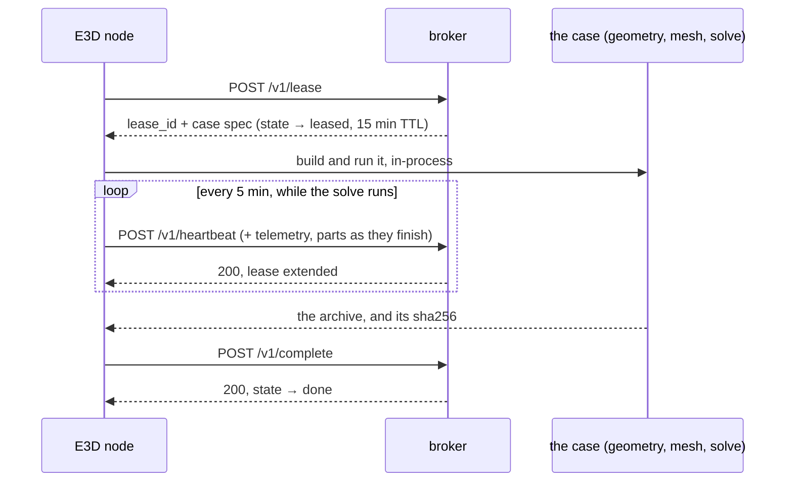

# The protocol

How a worker and the broker talk, and what each call promises.
See [DOMAIN.md](../DOMAIN.md) for what the nouns mean.

## How the client and server interact

The broker is an HTTP service in front of a database. It hands out work and
records results, and it **never initiates anything** — it does not know which
machines exist until one asks for a case, and it cannot reach into a cluster to
start a job. Every machine runs the same client, and each one *pulls*:

```
  PACE Phoenix  ──┐
  PACE ICE      ──┤   POST /v1/lease        ┌──────────┐      ┌──────────┐
  workstation   ──┼──  "give me a case"  ──▶│ casebroker│ ───▶ │ Postgres │
  anyone else   ──┘                         └──────────┘      └──────────┘
                                             stateless         the campaign
```

That is the whole reason for a broker rather than splitting the case list up
front: the machines differ by more than an order of magnitude in throughput and
Phoenix's availability changes hour to hour, so a fast box simply comes back
sooner. Adding a machine needs no server-side change — only a URL and a token.

### One case, end to end

A worker loops: lease → run → report → repeat. The wrinkle is that a case takes
**hours** while a lease lasts **30 minutes**, so the client renews it from a
background thread while the CFD runs.


```mermaid
sequenceDiagram
    participant W as E3D node
    participant B as broker
    participant R as the case (geometry, mesh, solve)
    W->>B: POST /v1/lease
    B-->>W: lease_id + case spec (state → leased, 15 min TTL)
    W->>R: build and run it, in-process
    loop every 5 min, while the solve runs
        W->>B: POST /v1/heartbeat (+ telemetry, parts as they finish)
        B-->>W: 200, lease extended
    end
    R-->>W: the archive, and its sha256
    W->>B: POST /v1/complete
    B-->>W: 200, state → done
```

**The lease is the unit of ownership, not the case.** Every call after the first
is keyed by `lease_id`, never by `case_id` — that is what lets the broker tell
the rightful owner from a worker that woke up late still holding a stale claim.

Step by step:

1. **Lease.** Ask for one case. An empty list back means the queue is drained —
   a normal answer, not an error; after ten idle polls the worker exits so the
   SLURM allocation is freed.
2. **Receive.** The broker atomically claims a row and returns a `lease_id` with
   the full spec. Concurrency is settled here, inside one SQL statement.
3. **Run.** The node builds the case from the spec (`E3D`'s own site geometry,
   mesh and solve). The broker knows nothing about OpenFOAM; the spec is the only
   seam.
4. **Heartbeat.** A background thread renews every 5 min. A **409** means the
   case was taken away — the worker abandons it rather than finishing work it no
   longer owns.
5. **Report.** The node posts the archive's `result_uri` and sha256 with
   metrics, wall time and which machine produced it. Among the
   metrics, `height_source` names the building source the mesh was built from
   (`gba-lod1`, or `overture`), read from the geometry report beside the STLs —
   the case inspector draws a finished case from it. E3D nodes sent it from
   Eddy3D dev 2026-10-09 on; for a case finished before that, `builder`
   (`eddy3d-native`, `eddy3d-thermal`) answers instead, since the node's site
   builder meshes GBA LoD1 only.
6. **Repeat.**

Defaults are the client's: `lease_seconds=900`, `heartbeat_seconds=300`.

### When a worker dies

Phoenix's free `embers` QOS preempts after an hour, so a worker dying mid-solve
is the *normal* case, not an edge case. All three paths end with the work getting
done; they differ in how much is wasted.

| | What happens | Cost |
| --- | --- | --- |
| **Preempted** (SIGTERM first) | The client catches the signal and calls `POST /v1/release`. State → `pending`, **and the attempt is refunded** — preemption is not the case's fault. | One partial solve. Back in the pool in under a second. |
| **Killed** (no warning) | Heartbeats simply stop and the lease TTL lapses. The next lease reclaims it; if nobody asks for 48 hours, the dashboard's status check records `stale-released` and returns it to pending. | Up to one lease period of idle before someone re-leases it. |
| **Zombie returns** | The old worker finishes and calls `complete` with a superseded `lease_id`. Rejected with **409**; the real owner's result stands. | Nothing — but see below. |

The third is the dangerous one, and why every mutating call re-checks the lease
rather than trusting it — see *Three design decisions worth knowing* below for
what that prevents. The operational rule it leaves you with: **a 409 means
stop.** Wherever it appears, heartbeat or complete, the case belongs to someone
else now, and continuing burns core-hours on a result the broker will refuse.

## The protocol

### Who may call what

Every endpoint below is gated on one of these principals.

| Principal | How it authenticates | Gets |
| --- | --- | --- |
| A logged-in **admin** | session cookie from `POST /v1/auth/login` | everything |
| A logged-in **operator** | the same | runs the campaign: everything a worker can do, plus adding cases. `403` from `DELETE /v1/cases`, from the identity endpoints, and from `/v1/workers/tokens`. The role most accounts should have |
| A logged-in **viewer** | the same | reads only; `403` from every mutating endpoint |
| A **machine** | `Authorization: Bearer <per-machine token>` | read and write, but never the identity endpoints — a worker credential that could mint more worker credentials would defeat the point of issuing them per machine. It may only lease as **its own** worker id or one under it — `phoenix` covers `phoenix-<job>-<task>`, which is how a cluster gets one revocable credential — and gets `403` otherwise, so the Machines list is a fact rather than a claim. Every call keyed by a lease after that (heartbeat, complete, fail, release, telemetry, parts, fields) answers `409` for a lease not held under its name: a `lease_id` alone is no proof, and no case read serves it |
| A **shared env token** | `Authorization: Bearer <value>` | read and write (`CASEBROKER_WRITE_TOKENS`) or read only (`CASEBROKER_READ_TOKENS`). The older model; still honoured |
| A **share link** | the `wsb_share` cookie that `POST /v1/auth/share` sets, or `Authorization: Bearer <link token>` | reads only, as a `viewer` does; `403` ("this is a read-only link") from every mutating endpoint and `401`/`403` from the identity endpoints. Made by an admin, named, expiring, revocable, and checked against the database on every request, so a revocation ends it on its holder's next click |

With **no env tokens and no accounts**, auth is off entirely and every caller
gets write. `GET /healthz` reports `"auth": "OPEN"` so that is visible rather
than silent. Creating the first account closes it.

### Identity

| Endpoint | Purpose |
| --- | --- |
| `GET /v1/auth/state` | What the login UI needs before anything is typed: `needs_setup`, `setup_token_required`, the `roles` this broker accepts (so a picker cannot drift from the server), and who you already are. **Unauthenticated** — it leaks nothing beyond "has this broker been set up", which is obvious from whether logging in is possible |
| `POST /v1/auth/setup` | Create the FIRST account, which is an admin. **Open only while there are none**, and `409` forever after. Requires `CASEBROKER_SETUP_TOKEN` if set, else one of `CASEBROKER_WRITE_TOKENS` if any are set, else nothing — see [First run](operations.md#first-run-from-nothing-to-a-working-broker). A read token is never enough |
| `POST /v1/auth/login` | Username and password for a session cookie. Throttled: 10 failures per account per source address in 5 minutes, then `429` |
| `POST /v1/auth/logout` | Delete the session server-side, and clear the share-link cookie too |
| `POST /v1/auth/share` | `{token}` → trade a share link's token for the read-only `wsb_share` cookie (HttpOnly, SameSite=Lax, `Secure` over TLS). **Unauthenticated**, throttled to 25 unknown tokens per source address in 5 minutes (`429`). `401` for a token the broker does not know; `410` for one that expired or was withdrawn, saying which. Someone already logged in keeps their login: they get `{"already_signed_in": true}` and no cookie |
| `GET /v1/shares` | Every share link still on record, `state` `live` / `expired` / `revoked`, with who made it, when it was last used and how often it was opened. Never the token. **Admin** |
| `POST /v1/shares` | `{label, ttl_seconds?}` → make a read-only link and return its token **once** (only the hash is stored), with the `url` to send: the token rides in the **fragment** (`/#share=…`), which a browser sends to nobody. `ttl_seconds` defaults to a week; `null` is until revoked; 300 s to a year. `label` is the admin's own note, never shown to the holder. `409` at 50 live links. **Admin** |
| `DELETE /v1/shares/{id}` | Revoke a link, effective on its holder's next request. **Admin** |
| `GET /v1/users` | Every account, its role, and when it last logged in. **Admin** |
| `POST /v1/users` | Add an account. Defaults to `viewer` unless `role` says otherwise, so a privilege is asked for rather than inherited by omission. **Admin** |
| `POST /v1/users/{username}/role` | Promote or demote. Refuses to demote the last admin. **Admin** |
| `POST /v1/users/{username}/password` | Change your own (needs `current_password`) or, as an admin, reset someone else's. Revokes every session that account holds |
| `DELETE /v1/users/{username}` | Remove an account and its sessions. Refuses the last admin |
| `GET /v1/workers/tokens` | Every machine credential, with `last_seen_at`. **Admin** |
| `POST /v1/workers/tokens` | Mint one machine's credential and return it **once** — only its hash is stored. **Admin** |
| `DELETE /v1/workers/tokens/{name}` | Revoke one machine, effective on its next request. **Admin** |

### The campaign

| Endpoint | Purpose |
| --- | --- |
| `POST /v1/cases` | Append cases. **Idempotent** — re-posting an existing id is a no-op, which is how the dataset grows. A case may carry `labels` (up to 16 key/values, `campaign: v2-pilot`); re-posting a case rewrites them, which is how a campaign is labelled after the fact. A case may name a case it `needs` (docs/mrt.md): it is handed to no node until that one is done, and a `needs` the broker has no case for is `422` |
| `GET /v1/cases` | Paginated, filterable (`state`, `split`, `city_cluster`, `label` as `key:value` or `key`) list of cases, most recently touched first — what the dashboard's case browser calls. Each row carries its `labels`. `after=<case_id>` pages by key in case_id order, and a case_id-ordered page carries `next_after` (None on the last): an offset skips a row whenever a case leaves the selection between two pages |
| `GET /v1/cases/{case_id}` | One case's full record by id, with its `labels`, `place` (country and nearest town), `telemetry` (parsed; `{}` when the node reported nothing), `percentiles` (for every [dataset metric](#telemetry-and-the-dataset) the case has a value for, `{value, all, lcz}` — its percentile rank 0..100 among every case, and among cases of its own LCZ, `null` without one; ranked against the cached aggregate without ever waiting for it, `{}` until the first one after a broker start is ready) and its **stages**: the trail of progress lines grouped by the stage each names (geometry, build-case, mesh, solve, gate, archive), each with how long it took and its last line; `current` for a running case, `failed_in` for the stage the last failure landed in. `moved_to` / `moved_from` are `{case_id, recipe, at, by, reason}` for a case moved to another recipe (`POST /v1/cases/respec`), else `null`. `needs_case` and `needs_state` say which case this one waits for and where that one stands (`null` when it needs none, `missing` when the broker no longer has it). The page endpoint above never carries `telemetry` |
| `POST /v1/cases/{case_id}/cancel` | **Pull a leased case off its node**, on purpose: the node hears at its next heartbeat (409, "stop") and a result it delivers after that is refused; the attempt is refunded. `{reason, park}` — requeued by default, or parked in quarantine carrying the reason, where reopen finds it. **Admin session**; who and why go in the trail |
| `GET /v1/storage` | How much space the database uses: the total, per table (rows, size, index share) largest first, bytes per case, and the plan's limit when known -- `CASEBROKER_DB_QUOTA_MB`, or for a Supabase DSN an assumed 500 MB free plan, labelled as the assumption it is. What the dashboard's header **storage** button shows |
| `GET /v1/dataset` | The campaign as a dataset: `counts` by state, split, LCZ, recipe and country (the 40 largest listed by name, ties broken alphabetically, then `unknown` for sites no country claims and `other` for the rest), and per metric its distribution over every case and per LCZ -- see [Telemetry and the dataset](#telemetry-and-the-dataset). Computed from every case, read a page at a time, and cached 60 s; while one request recomputes it, others are served the previous answer rather than waiting. `503` with `Retry-After` when the computation failed and there is no earlier answer to serve (a failure is remembered for the 60 s too). **Read scope** |
| `GET /v1/errors` | Every case that carries an error, in one answer: `last_error` in full, the site's coordinates, and each failed attempt with the worker, host and cluster it failed on. Quarantined first, then most recent; `limit` (default 2000, max 5000) and `truncated` says when it bit. What the dashboard's **Copy all errors** button turns into text for a bug report |
| `POST /v1/lease` | Claim up to N cases. Empty list = drained, not an error. Workers report their `host`/`cluster` here (optional) so "what machine produced this" stays answerable later. A node says `can_continue_from_broker` when it can fetch a mesh from the broker's part store; only such a node is handed a case another node started, and only while the broker holds its mesh. `syncthing_id` and `can_continue: true` from nodes before 2026-10-06 are ignored. Protocol 2 adds `features`, `cpus` and `mem_gb` -- see [Protocol 2](#protocol-2-capabilities-machines-stages-handoffs) |
| `GET /v1/node/release` | What this node should be running: the fleet's (or its canary) target, the file and sha256 for its platform, when to switch, whether it is draining, and -- when the broker holds that file -- `url` (relative to the broker) and `bytes`, else null. Asked before every lease and at every heartbeat; carries `build`, `platform`, `state` (what it is doing about the target), `failed_build` (it tried and rolled back) `cpu` (how busy the whole machine is, percent of every core, measured since its last ask; kept with its time and dropped when it is not a percentage) and `unfit` (why it will not take a case at all: its own check refused -- a full disk, an engine that is not running. Kept on the worker's row, with `unfit_since`, until an ask says nothing or the node leases; a node that has never leased gets a row for it, and the start of a spell is an `unfit` event). See [releases.md](releases.md) |
| `GET /v1/releases/{build}/{platform}/file` | That file, for a node to install: `ETag`/`X-Sha256` are its sha256, which the node checks before it runs a byte of it; byte ranges are answered, so a broken download resumes. `410` while the broker does not hold it. **Write auth** (a machine token; not a viewer or a shared link). Uploading is admin-only: [releases.md](releases.md#the-files) |
| `POST /v1/heartbeat` | Extend the lease. **409 means stop working on that case** -- also for a per-machine credential naming a lease another machine holds (as for complete, fail, release, telemetry, parts and fields). Refused once the lease is older than `CASEBROKER_MAX_LEASE_AGE` (7 days), which releases the case: a heartbeat proves the worker is alive, not that it is progressing |
| `POST /v1/complete` | Report a result pointer + metrics. Send `case_id` alongside `lease_id`: it scopes the retry-safety check to this case, so a runner whose `result_uri` is not unique per case cannot have one case's retry confirmed by another's row. Optional, so older workers keep working |
| `POST /v1/fail` | Report a failure; `retryable=false` quarantines immediately. A retryable failure goes back to `pending`. For `CASEBROKER_FAIL_COOLDOWN` (12 h), no worker on the failing host is handed it again, fresh or as a resume, so the next attempt runs on another machine |
| `POST /v1/release` | Graceful preemption — requeues and **refunds the attempt**. `handoff: true` is a node passing a case on after its share (protocol 2): the same, plus the case goes to another machine first |
| `POST /v1/telemetry` | `{lease_id, case_id, kind, data}`: the node's latest structured report of one `kind` for the case it holds, replacing that kind only. `200` stored; **`409` means stop sending telemetry for this case** (the lease is not current, or not this case's, or -- for a per-machine credential -- not held under that credential's name, the rule `/v1/lease` applies) and is never retried; `413` for `data` over 32 KiB or a 17th kind on one case, the size measured as stored: compact JSON with non-ASCII escaped as `\uXXXX`; `422` for a `kind` outside `^[a-z][a-z0-9_]{0,31}$`, or `data` nesting objects/arrays more than 16 levels deep (`data` itself is level 1). One kind is kept differently: `residuals` is a series per wind direction, held in its own table and not counted among the 16 ("The residual curves", below); `422` for it also means `data` is not a residual series, `413` a 65th direction. A NaN or infinity is stored as `null`, a lone UTF-16 surrogate as U+FFFD. A broker from before this route answers `404`, and the node then stops sending telemetry for the rest of its process -- so this route never answers 404. **Write auth** |
| `GET /v1/cases/{case_id}/residuals` | The residual curves of a CFD case: `directions` (which wind directions have one, each with `source`, `n` points, the last `iteration`, `end_time`, `reported_at`, `worker`) and `series` of one of them -- `?direction=` names it, else the one reported most recently. `200` with an empty list for a case that has none, `404` only for a case that does not exist. **Read auth** |
| `DELETE /v1/cases` | Purge a superseded campaign, with its events and footprints. **Admin session** (a write bearer token also passes, as it always has; an `operator` session does not). `dry_run` defaults to **true**, so a half-remembered curl reports what it would have deleted instead of deleting it; `expect` is the real interlock — state the row count you believe you are removing, and a mismatch refuses |
| `GET /v1/status` | Counts by state and split, expired leases, 24 h throughput, ETA |
| `GET /healthz` | Liveness, plus `protocol` and `features` (what a node may count on; see Protocol 2), the running `version`, auth posture (`token` / `accounts` / `OPEN`), per-scope token counts and redacted DB target. **Unauthenticated** — see Deploying |
| `GET /v1/whoami` | What the presented credential can do (`write` / `read` / `none`) **and which kind it is** — a session, a per-machine token, or a shared env token. **Unauthenticated** — it answers *about* a credential rather than gating on one |
| `GET /v1/share-token` | The read-only env token, for brokers that set `CASEBROKER_READ_TOKENS`. **Write auth** — not an escalation, since a write token already passes every read gate. The dashboard no longer needs it: **Settings ▸ Sharing** makes a named, expiring, revocable link with `POST /v1/shares` |
| `POST /v1/pair/start` | A machine asks to join: `{name, token_hash, host?, platform?}` → `{user_code, verification_url, expires_in, interval}`. **Unauthenticated** (it has nothing to authenticate with yet), so throttled per address and the queue is bounded. The node generates its own token and sends only the SHA-256 — the raw credential never reaches the broker |
| `POST /v1/pair/poll` | `{user_code}` with the token as bearer → `pending` / `approved` / `denied` / `expired` / `superseded`. An unknown code and a wrong token get the same 404 |
| `GET /v1/pair/pending`, `POST /v1/pair/{code}/approve`, `…/deny` | The dashboard's side. **Admin session only** — a credential that could approve machines could mint credentials |
| `POST /v1/cases/land-audit` | Find cases already in the campaign whose coordinates are not on land and quarantine them. `dry_run=true` by default — it reports and changes nothing. **Write auth** |
| `POST /v1/cases/respec` | **Move cases to another recipe**: `recipe`, plus `case_id` (repeatable) and/or `error_contains` (the case's last failure, as for reopen), `reason`. Each site is admitted again under `recipe` as a new case, the one `POST /v1/cases` would make, and the old case is parked in quarantine with a pointer to it. Only nodes declaring `recipe` are handed the new case, and its new id means no node can resume the old recipe's mesh as it. A leased case is skipped (cancel it first), and so is a done one; each skip says why in `skipped`. A recipe no worker has declared and no case carries is `422`, since it's a typo. `known_to_builds` names the builds that declare it. `dry_run=true` and `limit=50` by default; the limit bounds how many are moved. **Write auth** |
| `POST /v1/fleet` | Report what a scheduler holds (`cluster`, `queued`, `running`, `detail`, and optionally `jobs`: up to 500 of `{id, state, reason, submitted_at, start_at}`, which the Worker Fleet table lists for the jobs that have not started). The broker cannot see SLURM; `slurm/fleet_report.py` pushes this for the E3D node jobs on PACE (with the node's own credential), `casebroker fleet` from any login node with the package |
| `GET /v1/cases/{case_id}/footprints` | Everything a case is meshed from, cached: building footprints with predicted heights (GeoJSON), plus `terrain` (GEDTM30 relief grid) and `canopy` (Meta/WRI tree heights) over the mesh domain. Same sources and bbox the runner meshes, so the picture is the geometry. The buildings come from the source the case's mesh was built from — its reported `height_source`, GBA for a case an E3D node built (`builder: eddy3d-native` or `eddy3d-thermal`, whose site builder meshes GBA LoD1 only), Overture if it finished before the switch to GBA, GBA otherwise — carried back as `mesh_source`, with `mesh_source_basis` saying how that is known (`reported`, `native_builder`, `before_gba`, `unreported`, `not_done`, `unrecognized`). `source` is what actually answered, with `fallback_from` when the mesh's source could not be drawn; a cached row from a different source is queried again, and concurrent requests for one case share one query |

State machine:

```
pending --lease--> leased --complete--> done
   ^                  |
   |                  +-- fail(retryable) | lease expiry --> pending
   |                  +-- fail(fatal) | attempts > max ----> quarantined
   +-- release (preemption, attempt refunded) ---------------+
```

A move to another recipe (`respec`) parks a pending or quarantined case in
`quarantined`; its site continues as a new, pending case under the new recipe.

### Telemetry and the dataset

Completion metrics arrive once, at the end, and only for a case that finished.
Telemetry is what the node learns on the way, posted as it happens and kept on
the case (`cases.telemetry`, one JSON object keyed by kind). Each post replaces
its kind and stamps `at` (when the broker heard it) and `worker` (who held the
lease). It is kept through complete, fail and release -- it describes what
happened -- and deleted with the case. It describes ONE attempt: a lease that
starts the case over (any claim that is not a resume) clears it, so a done case
is never described by an earlier, failed attempt's mesh when the attempt that
finished reported less; a resume continues the same work and keeps it. The
kinds the node sends:

| Kind | When | `data` |
| --- | --- | --- |
| `site` | once the site geometry is built (a resumed case: from the site report on disk) | `urban_form` (the flat indices of the completion metrics: `bcr`, `bht_m`, `bdr_m`, `vr_ring`, `vr_exposed`, `ar`, `open_space_width_m`, `bht_sigma_m`, `rar`, `svf`, `svf_dome`, `lambda_f_min`, `lambda_f_max` -- whichever exist -- and one table, `lambda_f_by_direction`, below), `n_buildings`, `terrain_relief_m`, `canopy_fraction`, `dem` |
| `mesh` | once the mesh verdict is in, fresh and resumed | `meshes` (per mesh: `ok`, `failed_checks`, `negative_volume_cells`, `max_skewness`, `max_non_orthogonality`, `cells`), `total_cells`, `all_ok`, `mesh_seconds` (null on resume), `ranks`, `cells_per_rank`, `engine`, `build`, `recipe`, `directions` |
| `solve` | from the solve watcher, only on change and at most every 300 s, plus once per finished direction | `directions_total`, `directions_done`, `current`, `iteration`, `end_time`, `residuals` (the newest initial residual of each field), `finished` (per direction: `iterations`, `status`) |
| `residuals` | with each `solve` report, for the direction being solved, and once more, `complete`, when a direction finishes | one direction's residual history: `direction`, `iterations`, `fields`, `end_time`, `total`, `complete` -- see below. **Kept per direction, not as the latest of its kind** |

### The residual curves

A `solve` report says where the solve is and what its newest residuals are, which
cannot tell a direction that fell three decades from one that has sat at 1e-3 for an
hour. The curve can, so the dashboard draws one (log residual against iteration, a
line per field, a picker for the wind direction) from `GET /v1/cases/{id}/residuals`.
It comes from the node as telemetry kind `residuals`:

```json
{"direction": "case_112",
 "iterations": [1, 14, 27, "..."],
 "fields": {"Ux": [0.99, 0.5, "..."], "p": [1.0, 0.7, null], "k": ["..."]},
 "end_time": 2000, "total": 853, "complete": false}
```

`iterations` are the solver's own (OpenFOAM's `Time`), non-decreasing, 1 to 1,000 of
them; every field is as long as `iterations` and holds that field's INITIAL residual
at each point, `null` where it was not solved in that iteration or was not finite (a
diverging solve prints `nan`). A node decimates a 2,000-iteration solve to about 160
points to fit the 32 KiB a post may carry, keeping from each stretch the point where the
worst residual is, so a spike survives; `total` says how many iterations it was cut
down from. `end_time` is the cap the direction runs to, which lets a chart of a running
direction fill as the solve progresses instead of rescaling under it.

How the broker keeps it, because it differs from the other kinds:

* **One series per (case, direction)** in `case_residuals`, replacing that direction's
  series wholesale on each post and leaving the others alone. A case has 32, which
  neither the 16 kinds nor the 32 KiB per kind could hold, and `GET /v1/cases/{id}`
  stays small. At most 64 directions per case (`413` beyond).
* **Cleaned and bounded on the way in.** Values are kept to four significant digits.
  A series whose iterations go BACKWARDS is cut to its last run: the numerics ladder
  restarts a direction from 0 on a safer rung and its solver tees into the same log, so
  a log read whole is the failed run followed by the current one. A record whose fields
  are not as long as `iterations`, whose direction is not a case directory name
  (`case_...`), or with a non-numeric value is `422` and writes nothing.
* **A node that sends none still gets a coarse curve.** The broker adds the newest
  residuals of each `solve` report as a point of the current direction's series
  (`source: "reports"`, a dozen points an hour at most, the oldest dropped past 600).
  A series a node sent (`source: "trace"`) is never added to by a report, and replaces
  one made of reports. The dashboard draws a `reports` series with a dot per point and
  says what it is made of.
* **It lives with the attempt, except for what the case holds.** A fresh claim starts
  the case over and deletes the series of every direction that has no part
  (`POST /v1/parts`) -- a direction whose result the next node takes over from the
  broker's copy keeps the curve that produced it. A new mesh, `casebroker parts reset`
  and a purge delete them all.

`GET /v1/dataset` turns every case into distributions. Each metric has a
`label`, `unit`, `group` and one set of 25 `bins` edges (24 bins) from the
campaign-wide p1..p99 -- shared by `all` and every `by_lcz` entry, so the
reference sets draw on one axis; values outside land in the end bins. Each set
is `{n, min, p10, p25, median, p75, p90, max, mean, hist}` (quantiles by linear
interpolation); a metric nothing has reported yet is listed with `n: 0` and an
empty `hist`. A value is counted only when it is a JSON number (not a bool or a
string) of magnitude at most 1e300; anything else is ignored rather than allowed
to overflow the statistics. Where the values come from:

| Group | Metrics | Source |
| --- | --- | --- |
| urban | the thirteen `urban_form` indices | `telemetry.site.urban_form`, else the completion metrics' `urban_form` |
| site | `n_buildings`, `terrain_relief_m`, `canopy_fraction` | `telemetry.site` |
| mesh | `total_cells`, `max_skewness`, `max_non_orthogonality` | `telemetry.mesh` (the worst mesh of the case), else `mesh_cells` for `total_cells` |
| run | `case_seconds`, `mesh_seconds`, `solve_seconds` | the completion metrics, `done` cases only |

**The frontal area index is per wind direction.** `urban_form.lambda_f_by_direction`
is λf -- the façade a wind meets, projected across it, per unit of the core's plan
area -- keyed like the node's `z0_by_direction`: wind FROM, `"000"`, `"011.25"`, …
(Eddy3D `docs/DOMAIN_MODEL.md`, "Urban form indices"). A table is not one number per
case, so the dataset ranks its extremes, `lambda_f_min` and `lambda_f_max`, and not
its mean, which is `vr_exposed`/π and already a column. The values themselves go
where the per-direction results are: every field record (`GET /v1/cases/{id}`'s
`fields`, and `GET /v1/cases/{id}/fields`) carries `lambda_f`, the value at the
angle that field was solved for (`deg`), matched by angle and never by the nearest
bearing; `null` where the site report has none for it (a site built before the node
computed it), never 0, which is a site with no buildings.

A case's `percentiles` are ranked against the same cached aggregate, exactly
(from its sorted values): the share of cases below plus half the share equal,
so the median of an odd set is 50 and the largest of 100 is 99.5.

### Custody: what has arrived

`done` is the node's word: `POST /v1/complete` names an archive on the node's own
disk (`file:///C:/wind/done/<case>.tar.gz`) and its sha256. Whether it ever
reached a place it is kept intact, and whether every direction's pedestrian
field reached the database, has a different answerer, so it is kept per
artifact and never folded into `state` (DOMAIN.md, "Custody").

| Call | Scope | What |
| --- | --- | --- |
| `POST /v1/cases/{id}/receipts` | write | `{kind: "archive", location: "master", sha256, bytes, path}` from the holder of a copy that hashed it (location `broker` is the broker's own, written when its part store holds the case). 409 when the case is not done or the hash is not the one the node reported (a corrupted or different archive); 422 for a malformed receipt. No lease; a second report of the same artifact replaces the first. |
| `GET /v1/cases/{id}/receipts` | read | The case's receipts. Also on `GET /v1/cases/{id}` as `receipts`. |
| `GET /v1/custody?recipe=&older_than_hours=&limit=` | read | `done`, `stored` (nothing missing), `missing_archive`, `missing_fields`, and the cases still missing something, oldest first: `missing` (`archive`, `fields`), `fields` against `fields_expected` (the case's telemetry `solve.directions_total`, else `mesh.directions`; none for a thermal case). `older_than_hours` leaves out what may still be syncing. |

A field's receipt is its `case_fields` row: the broker stored it. The archive's
comes from the part store, or from `scripts/report_receipts.py` run where a copy is: it hashes only what
`/v1/custody` lists, and only a case whose archive and every part its manifest
names are present and verify (`casebroker.archives.status`).

### Asking the wind field

The broker holds each finished direction's |U| at 1.75 m (`case_fields`: float32 on the
case's 2 m lattice, metres east (+x) and north (+y) of the site centre, NaN inside a
building). A case is 32 such fields and the campaign about 160,000, so nothing here hands
over a field to answer a question about it: a point reads 16 bytes of each field and a
region the band of rows it spans, in place (`substr()` of the blob, which Postgres reads
from just those TOAST chunks: the column is `STORAGE EXTERNAL`), and a query across cases
reads no field at all -- it filters on the statistics the broker computed when it stored
each one. U/U_ref (`vr`) is |U| over the field's `u_ref`, the inlet log law at its height:
the number that compares one site with another.

| Call | Scope | What |
| --- | --- | --- |
| `GET /v1/fields?recipe=&lcz=&split=&city_cluster=&state=&label=&case_id=&direction=&height_m=&where=&sort=&limit=&offset=` | read | Fields across cases, one record per (case, direction) at 1.75 m (or exactly `height_m`): grid, `u_ref`, `coverage`, `n_valid` (cells with air), `umag_mean`, `umag_min`, `umag_p05` `p25` `p50` `p75` `p95` `p99`, `umag_max`, the node's `umag_p999`, each also as `vr_*`, and the case's `recipe`, `lcz`, `split`, `city_cluster`, `state`, `lat`, `lon`. `where` (repeatable, ANDed) is `<number><op><value>` over those numbers, `deg`, `height_m`, `coverage`, `u_ref` and `n_valid`, with `<` `<=` `=` `!=` `>=` `>`: `where=vr_p95>=1.2&where=deg<90`. `sort` is one of them, `-` first for descending, missing values last. `label` is `key:value` or `key`. 422 names a clause or key that is not one. `limit` at most 1000; `total` is the whole match |
| `GET /v1/cases/{id}/umag?x=&y=` or `?lat=&lon=` (`&height_m=&direction=`) | read | \|U\| at one point in every direction the case has (or those named): `umag`, `vr`, `u_ref`, `nodes_valid`, per direction, and the point in both frames. Bilinear between the four lattice nodes around it; a node inside a building is left out and the rest reweighted, and `umag` is null where none of the four has air. `lat`/`lon` are placed by the site frame the node built the case in (110 540 m per degree of latitude, 111 320 cos(lat) per degree of longitude, around the case's own `lat`/`lon`). 422 for a point off the field (more than half a spacing past its outer nodes) |
| `GET /v1/cases/{id}/umag/stats?bbox=xmin,ymin,xmax,ymax` and/or `?radius_m=&x=&y=` (or `&lat=&lon=`), `&above=&above_vr=&height_m=&direction=` | read | The same statistics over a region, per direction: a box in site metres, a disc, both (their intersection), or neither (the whole field, which matches the stored statistics). `above` (m/s) and `above_vr` (U/U_ref), repeatable, give the share of the region's air STRICTLY above each threshold, keyed by the threshold (`"5"`, `"1.2"`). `cells` counts the lattice nodes in the region, `n_valid` those with air; `region.area_m2` is `cells` times the spacing squared |

`GET /v1/cases/{id}/fields` and a case's `fields` carry the stored statistics too. A field
stored before the broker computed them gets them when the broker next starts (a background
pass, ten at a time); until then it matches no `where` on them. A field stored
gzip-wrapped (before 0.28.0) cannot be read in place and is read whole instead, with
the same answers.

**Backfill.** `PUT /v1/cases/{id}/fields/{direction}/backfill` (write) takes the same umag/1
body for a DONE case that has no field for that direction -- one finished by a build from
before fields went to the broker, or whose field did not get through -- read by a node from
the archive it still holds. No lease: the case is finished. A machine may send it for a case
it completed or a direction it reported (`POST /v1/parts`); 403 otherwise, 409 when the case
is not done or already has the field (a solve's own is never replaced), 404 for no such case.
`POST /v1/parts/wanted` lists, per case, the directions whose field the broker holds
(`fields`), so a sweeping node backfills the rest.

### Parts the broker holds

With `CASEBROKER_PARTS_DIR` set, a node uploads each part of a case to the broker as
it ships it -- the mesh, every finished direction, the case's archive last. Since the
Syncthing master was retired (2026-10-06) this is the only copy that leaves the node. The broker keeps the bytes as files named by
their sha256 (`casebroker/partstore.py`), not in the database: a campaign case is ~8.5 GB
of parts. The database holds which case, which part, the hash, the size and when.

| Call | Scope | What |
| --- | --- | --- |
| `POST /v1/cases/{id}/parts/{part}/upload` | write | `{sha256, bytes}` of the file the node holds. `part` is `mesh`, `case_<dir>` (both reported first, `POST /v1/parts`) or `archive` (the case's own archive: the case must be done, and the hash is the completion's). Answers `state`: `stored` (nothing to send), `verifying` (all sent; ask again), `declined` (this broker does not keep that kind -- the node keeps it on its own disk), `absent` / `partial` with the `offset` to send from and the `chunk_bytes` to use. 409 for a hash or size that is not what was reported, 404 for an unreported part, 507 when the store would pass its limit or cut into its reserve of free space |
| `PUT /v1/cases/{id}/parts/{part}/upload?offset=&bytes=` | write | One chunk (at most 64 MiB, under Cloudflare's 100 MB a request), written at `offset`; `bytes` is the whole part's size. 409 with the broker's `offset` when that is not where the upload stands, so the node resumes from there. A chunk is all or nothing. The last one starts the verification in the background (`verifying`): a 6.5 GB archive takes a minute to hash on the server, longer than the reverse proxy waits |
| `GET /v1/cases/{id}/parts/{part}/blob` | read | The part's file. Byte ranges are answered, so a fetch resumes; the ETag is the sha256 |
| `POST /v1/parts/wanted` | write | `{case_ids: [...]}` (at most 500): for each case the broker has, the parts it would take -- reported (or a done case's archive, by its completion's hash), not held yet, of a kind it keeps -- as `{state, wanted: [{part, sha256, bytes, archive}]}`, the mesh first. What a node asks when it sweeps its done folder (at start, after each case, after an outage), so parts that reached nobody go up in bulk. Each case also lists `fields`, the directions whose field the broker holds, for a node to backfill the rest. Without a store `enabled` is false and no part is wanted; the fields are still listed |
| `GET /v1/cases/{id}/blobs` | read | What of the case the broker holds, and `complete`: its archive and every part it reported |
| `DELETE /v1/cases/{id}/parts/{part}/blob` | admin | Stop holding one part; its file goes when nothing else refers to the content |
| `POST /v1/parts/sweep?dry_run=` | admin | Files no case refers to (a replaced mesh's parts) and stale uploads. Reports by default |

A case with a mesh on record goes only to a node that leases with `can_continue_from_broker:
true`, and only while the broker holds that mesh: nothing else can give a node another node's
mesh. A node that says nothing about continuing (neither field: from before parts) is handed
anything, as before, and meshes afresh. `can_continue` was "can fetch from the Syncthing
master"; `true` no longer counts.

Content is checked twice: the upload must hash to what the node reported, and the node
fetching a part checks it against the same hash. `GET /v1/cases/{id}/parts` (and the
parts on a lease) carry `at_broker`, so a node continuing a case knows it can fetch the
mesh from the broker. When the broker holds the archive and every reported part, it writes
the case's archive receipt at location `broker` -- the same `stored` the master's scan
gives, so `/v1/custody` counts either.

## Protocol 2: capabilities, machines, stages, handoffs

Additive, like everything worker-facing short of a MAJOR: a node that sends none of
it is leased exactly as before, and a node reading an older broker finds none of it.

**Capabilities.** `GET /healthz` carries `protocol: 2` and `features`, sorted:
`field_backfill`, `fields`, `handoff`, `hardware`, `heartbeat_stage`,
`machine_scoped_leases`, `node_release`, `parts`, `parts_wanted`, `residuals`,
`telemetry`, and `part_store` and `release_files` where a store is configured. A node reads it at start
and after every outage. A feature listed is one whose 404 is a hiccup (a proxy during
a deploy), not "a broker from before"; a feature missing is one not to send. Without
the list (an older broker) the node keeps its 404 heuristics. A node says what IT can
do with every lease, `features` (`continue_from_broker`, `handoff`, `heartbeat_stage`,
`residuals`, `telemetry`, `parts_upload`, `field_backfill`), kept on the worker row;
`continue_from_broker` there counts as `can_continue_from_broker: true`.

**The machine.** The lease's `cpus` (the cores the node gives a case) and `mem_gb`
(the memory it has) are kept on the worker row -- the fleet table shows them under
the host -- and steer what it is handed:

- *Started work first.* For a node that can continue from the broker, a pending case
  whose mesh the broker holds sorts ahead of fresh ones of its priority, so a
  handed-off case does not wait behind the whole queue.
- *Memory gate.* A case whose site has been meshed has `mesh_cells` (from `mesh`
  telemetry `total_cells`, kept across attempts). It is not handed to a node whose
  `mem_gb` is below `mesh_cells / 1e6 * CASEBROKER_GB_PER_MCELL` (default 2.0).
- *Small nodes do not mesh,* when the campaign says so: release policy
  `small_node_cpus` (`PUT /v1/releases/policy`, 0 = off). Below it, a node is handed
  only cases already meshed at the broker, and its own resumes.

**The stage.** A heartbeat may carry `stage` (`geometry`, `build-case`, `resume`,
`mesh`, `solve`, `gate`, `scene`, `trace`, `surface`, `archive`): the stage its
`detail` belongs to, in the node's words. It is kept with the progress line and the
case's stages are built from it; without one (or with a name this broker does not
know) the line is read as before.

**Handing a case on (sequential chunks).** A node started with `--max-directions N`
or `--chunk-hours H` solves its share of a case, ships every direction as it goes,
and gives the case back with `POST /v1/release {handoff: true}`: refunded like any
release, recorded as `handed-off`, and not handed to any worker on that host for
`CASEBROKER_HANDOFF_COOLDOWN` (900 s), fresh or as a resume, so another machine
continues it from the broker's mesh. Past the cooldown, with nobody else free, the
same node continues from its own scratch. A small machine contributes directions
without holding an 800-core-hour case for a week; an ICE job with `--chunk-hours 7`
hands its case on cleanly instead of losing the direction in flight to the wall.

## Three design decisions worth knowing

**Lease expiry is the liveness mechanism.** A worker that dies without warning
has its case reclaimed by the next `POST /v1/lease` in the same statement that
hands out fresh work. If nobody asks within 48 hours, a status check records a
`stale-released` event and returns the expired row to pending without refunding
its consumed attempt.

**A superseded lease cannot write.** If a worker is preempted, its case is
re-leased, and the original worker then wakes up and finishes, its `complete`
is rejected with 409. Without that, a zombie could overwrite the real owner's
result — and it would look exactly like a successful run.

**Splits are assigned by city, not by tile.** Tiles from one city share
morphology and often literal buildings at their edges, so a per-tile split leaks
the test set into training. `ids.split_for(city_cluster)` hashes the city, which
also means an existing case can never change split when the dataset grows —
unlike v1's `make_splits.py`, whose seed-42 shuffle over a fixed list reshuffles
everything the moment a case is appended.
